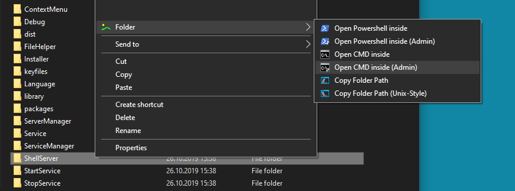

<h2 align="center">Sonnenberg</h2>

A Small But Useful Windows Explorer Extension
   
   
<a href="https://github.com/demispatti/Sonnenberg/tree/master/dist" target="_blank"><strong>Get Setup File</strong></a>
   
   
<a href="https://github.com/demispatti/Sonnenberg/issues/new?template=bug.md" target="_blank">Report A Bug</a> 
  <a href="https://github.com/demispatti/Sonnenberg/issues/new?template=feature.md&labels=feature" target="_blank">Request Feature</a>

---
## Table Of Contents
- [Features](#features)
- [Get Setup File](#get-setup-file)
- [Getting Started](#getting-started)
- [Automatic Project Setup (recommended)](#automatic-project-setup-recommended)
- [Manual Project Setup](#manual-project-setup)
- [Running The Tests](#running-the-tests)
- [Debugging The ShellServer](#debugging-the-shell-server)
- [Deployment](#deployment)
- [Documentation](#documentation)
- [Frequently Asked Questions](#documentation)
- [Bugs And Feature Requests](#bugs-and-feature-requests)
- [Contributing](#contributing)
- [Versioning](#versioning)
- [Creator](#creator)
- [Copyright And License](#copyright-and-license)
- [Built With](#built-with)
- [Acknowledgments](#acknowledgments)

---
## Features
This application extends the Windows Explorer context menu. After installation, you'll find the Sonnenberg icon with a drop down inside the Windows Explorer context menu.
Depending on the context, you'll be able to:

- Copy the path of the clicked item, folder or directory, also in Unix-style
- Open PowerShell inside any directory and folder
- Open Command Prompt inside any directory and folder
- Count lines of text and code files, with or without blank lines, and copy the result to the clipboard

### What It Looks Like

Works with any theme.

---
## Get Setup File
If you're just interested in using or testing the resulting software, you can get an installer file from [here](https://github.com/demispatti/Sonnenberg/tree/master/dist). Choose your language and architecture, and install the package. You can enable and disable the context menu extension via the *Windows Start Menu*, and the application can easily be uninstalled again.

---
## Getting Started
These instructions will get you a copy of the project up and running on your local machine for development and testing purposes.

### Prerequisites
Software:
- [Visual Studio Community](https://visualstudio.microsoft.com/vs/community/)
- [WiX Toolset 3.11.2](https://github.com/wixtoolset/wix3/releases/tag/wix3112rtm)

Visual Studio Extensions:
- [Microsoft Visual Studio Installer Projects](https://marketplace.visualstudio.com/items?itemName=VisualStudioClient.MicrosoftVisualStudio2017InstallerProjects)
- WiX Toolset Visual Studio Extension from [here](https://wixtoolset.org/releases/)

Project:
- [Clone](https://github.com/demispatti/Sonnenberg.git) the repository.

---
## Automatic Project Setup (recommended)
This step requires Powershell to be installed on your computer, which is shipped with all modern versions of Windows.

### 1. Run Setup.ps1 with Powershell
After the setup script has finished, open the solution with the IDE of your choice, restore NuGet packages and build the solution.

---
## Manual Project Setup
If the Quick Start option should fail, you can setup the solution manually. Just follow these simple steps in order to get up and running:

### 1. Create Assembly Info GUIDs
Create a GUID for each project's AssemblyInfo.cs file where it says YOUR_GUID_HERE.

### 2. Create Product.wxs File GUIDs
Inside the *Installer Project*, open Product.wxs and create *unique UPPERCASE* GUIDs in it where it says YOUR_GUID_HERE.

### 3. Product.wxs: Enter Manufacturer Name
Replace YOUR_MANUFACTURER_NAME_HERE with your name (required).

### 4. Restore NuGet packages

### 5. Build The Solution

---
## Debugging The Shell Server

### Prerequisites
Note #1:  
*if* you already take advantage of **Sonnenberg** on your computer, you need to stop the service first (e.g. via the Start Menu), in order to debug the ShellServer.dll you built.

Note #2:  
In order to debug the ShellServer.dll, you need a copy of the [SharpShell ServerManager](https://github.com/dwmkerr/sharpshell/releases/download/v2.7.2.0/ServerManager.zip). Download and unzip it.

### Start Debugging
1. Execute **ServerManager.exe** as Administrator. Select *File->Load Server*, navigate to "Sonnenberg\ShellServer\bin\Debug", and select *ShellServer.dll*.
2. Click *Server*, and then first *install* the Server and then *register* it for the architecture you want to debug.
3. Click *Explorer*. Make sure there is a tick where it says *Always Unload DLLs*.
4. Click *Restart Explorer*.
5. Open a Windows Explorer window up again.
6. In your IDE, click on the *Debug* tab and attach to process (explorer.exe).
7. Debug.
8. In order to rebuild, you need to go trough the *Stop Debugging* process described below.

Note #3:
In order to rebuild anything, you need to make sure the Shell Server ,A.K.A. ShellServer.dll, isn't installed and/or registered, since the file is locked by Windows Explorer during debugging as it is attached to an explorer.exe process. So you must have *Stopped Debugging* properly.
In addition, the Server Manager Window needs to be closed.

### Stop Debugging
1. In ServerManager.exe, mark ShellServer.dll.
2. Click *Server*, and then first *unregister* the Server and then *uninstall* it for the architecture you were debugging.
3. Click *Explorer*. Make sure there is a tick where it says *Always Unload DLLs*.
4. Click *Restart Explorer*.
5. *Close* ServerManager.exe.
6. Do your build-thing.
7. in order to debug again, well, you know...

---
## Deployment
Build the installer project and deploy the MSI file.

---
## Documentation
No need for a documentation.

---
## Frequently Asked Questions
#### Where do I interact with this extension and how does it work?
After installation, you'll find the Sonnenberg icon with a drop down inside the Windows Explorer context menu. Depending on the context, you'll be able to:

- Copy the path of the clicked item, folder or directory, also in Unix-style
- Open PowerShell inside any directory and folder
- Open Command Prompt inside any directory and folder
- Count lines of text and code files, with or without blank lines, and copy the result to the clipboard

#### Are there any known limitations?
No

#### Are there any known issues?
No.

---
## Bugs And Feature Requests
Have a bug or a feature request? Please first read the [issue guidelines](https://github.com/demispatti/Sonnenberg/blob/master/.github/CONTRIBUTING.md#using-the-issue-tracker) and search for existing and closed issues. If your problem or idea is not addressed yet, [please open a new issue](https://github.com/demispatti/Sonnenberg/issues/new).

---
## Contributing
Please read through our [contributing guidelines](https://github.com/demispatti/Sonnenberg/blob/master/.github/CONTRIBUTING.md). Included are directions for opening issues, coding standards, and notes on development.

Moreover, if your pull request contains JavaScript patches or features, you must include [relevant unit tests](https://github.com/demispatti/Sonnenberg/tree/master/js/tests). All HTML and CSS should conform to the [Code Guide](https://github.com/demispatti/code-guide), maintained by [Demis Patti](https://github.com/demispatti).

Editor preferences are available in the [editor config](https://github.com/demispatti/Sonnenberg/blob/master/.editorconfig) for easy use in common text editors. Read more and download plugins at <https://editorconfig.org/>.

---
## Versioning
For transparency into my release cycle and in striving to maintain backward compatibility, Sonnenberg is maintained under [the Semantic Versioning guidelines](https://semver.org/). Sometimes we screw up, but we adhere to those rules whenever possible.

See [the Releases section of our GitHub project](https://github.com/demispatti/Sonnenberg/releases) for changelogs for each release version of Nicescroll.

---
## Creator
**Demis Patti**
<https://github.com/demispatti>

---
## Copyright And License
This project is licensed under the MIT License - see the [LICENSE.md](LICENSE.md) file for details.

---
## Built With
* [SharpShell](https://github.com/dwmkerr/sharpshell)
* [nUnit](https://nunit.org/)
* [WiX Toolset](https://wixtoolset.org/)

---
## Acknowledgments
* Microsoft - Thanks for [Visual Studio Community](https://visualstudio.microsoft.com/vs/community/?rr=https%3A%2F%2Fwww.google.com%2F)
* [Dave Kerr](https://github.com/dwmkerr) - Thanks for SharpShell

